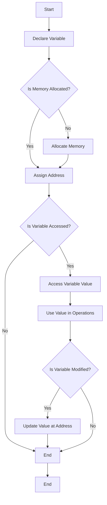
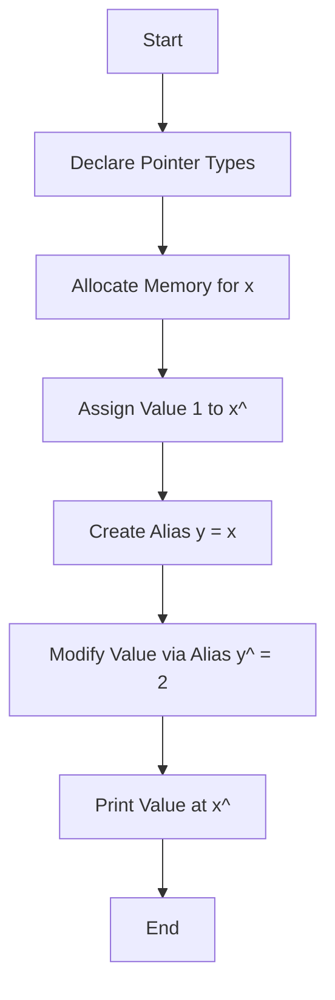

### What is a Variable in Programming?

A **variable** in programming is a symbolic name associated with a memory location in the computer. It acts as a container for storing data that the program can use, modify, or retrieve at any point during its execution. The value stored in a variable can change or vary, hence the name "variable." By associating a value with a variable, a program can reference and operate on that value in various operations, such as mathematical calculations or string manipulations.

#### Key Characteristics of Variables

Variables in programming are defined by a set of **six fundamental attributes**:

1. **Name (Identifier)**:  
   The name of a variable is an identifier that the programmer assigns to it. This is the label used to reference the variable in the program code. For example, in the statement `int x = 10;`, `x` is the name (or identifier) of the variable.

   - The name must adhere to certain rules depending on the programming language, such as only containing letters, digits, or underscores and not starting with a digit.
   - The name of a variable should be descriptive enough to make the code more readable. For example, `totalSales` is more descriptive than `x`.

2. **Address (Memory Location)**:  
   A variable's address refers to the specific location in memory where its value is stored. The memory address is usually managed by the system, and the programmer typically does not need to worry about it directly, though in some low-level languages like C, the memory address of variables can be accessed using pointers. Two variables can share the same address, which is known as an **alias**, leading them to reference the same memory location.

3. **Value**:  
   The value of a variable is the actual data it holds at a given moment. For example, if the variable `x` is defined as `int x = 10;`, its current value is `10`. The value of a variable can be changed during program execution by assigning new values to it.

   - In some cases, a variable can have an undefined or null value until it is initialized.

4. **Type**:  
   The type of a variable determines the kind of data it can hold, such as an integer, float, string, or a more complex user-defined type like objects or structures. The type of a variable also defines the range of values it can take and the operations that can be performed on it. For example:

   - In Java, the `int` type has a range from `-2,147,483,648` to `2,147,483,647`.
   - The type system ensures that variables store and work with the correct kinds of data.

5. **Lifetime**:  
   The lifetime of a variable refers to the period during which the variable exists in memory and is accessible to the program.

   - For variables declared within a function, their lifetime is limited to the execution of the function. These are often referred to as **local variables**.
   - **Global variables**, on the other hand, exist for the entire duration of the program’s execution.
   - **Static variables** maintain their value between function calls and persist throughout the program's execution, even if their scope is limited to a function.

6. **Scope**:  
   The scope of a variable refers to the region in the program where the variable can be accessed.
   - **Local variables** have a scope limited to the block of code (such as a function or loop) in which they are declared.
   - **Global variables** have a scope that spans across the entire program and can be accessed from any part of the code.
   - **Block scope** and **file scope** are additional examples where a variable’s visibility is restricted based on its declaration.

---

### Naming Variables

Variable names, or identifiers, are used to reference variables within a program. Different languages impose varying rules and conventions for naming variables.

#### Design Issues with Names

Several design questions arise when naming variables:

- **Maximum Length**: How long can a variable name be?  
  Older languages like FORTRAN limited names to short lengths (e.g., 6 characters), but modern languages like C++ or Java allow much longer names, with no predefined limits. However, long names may slow down compilation due to large symbol tables.
- **Notation**: Should certain conventions, such as camelCase or snake_case, be followed? How should names be formatted for readability and consistency?

- **Case Sensitivity**: Are variables case-sensitive? In many modern languages (such as C++ and Java), `foo`, `Foo`, and `FOO` are treated as different variables, which can cause confusion if not handled carefully.

---

### Common Variable Naming Conventions

- **Camel Notation**: Words are concatenated, with each subsequent word starting with a capital letter. Example: `totalSales`, `lastName`.

- **Underscore Notation (Snake Case)**: Words are separated by underscores. Example: `total_sales`, `last_name`.

- **Hungarian Notation**: A prefix is added to the variable name, indicating its type or scope. Example: `iTotal` (where `i` might stand for integer), `strName` (where `str` stands for string).

- **Prefix Notation**: A longer prefix (often three letters) is used to describe the type or usage of the variable. Example: `floSalesAmount` (where `flo` stands for float).

---

### Address of a Variable

The **address** of a variable refers to the specific memory location in a computer's memory where the variable's value is stored. Understanding variable addresses is crucial for tasks such as low-level memory management, pointer manipulation, and optimization in programming.

#### Key Concepts

1. **Memory Location**:

   - Every variable in a program is allocated a certain amount of memory to hold its value. This allocation occurs in various regions of memory, such as the stack, heap, or data segments.
   - The address represents the starting point of this allocated memory.

2. **L-Value and R-Value**:

   - An **L-value** refers to an expression that points to a memory location, meaning it can appear on the left side of an assignment statement. This is where a variable can be modified.
   - An **R-value** represents the value stored at that memory location and can be used on the right side of an assignment.

3. **Dynamic vs. Static Memory Allocation**:

   - Variables can be allocated memory either statically (at compile time) or dynamically (at runtime).
   - For example, in a recursive function, a variable's address may change with each invocation as a new memory space is allocated on the stack for each function call.

4. **Pointer Manipulation**:
   - In languages like C and C++, pointers allow programmers to directly manipulate memory addresses. This enables advanced techniques such as dynamic memory allocation, array handling, and more.

#### Example of Variable Addresses

Consider the following example in a C-like pseudocode:

```c
void functionA() {
    int x = 5; // Memory allocated for x
    functionB();
}

void functionB() {
    int y = 10; // Memory allocated for y
    // Both x and y have different memory addresses
}
```

In this example:

- When `functionA` is called, memory is allocated for `x`.
- When `functionB` is called, a separate memory allocation is made for `y`.
- Each variable has a unique address, and if `functionA` calls `functionB` multiple times, the address for `x` may differ across calls, especially if the stack frame changes.

#### Schematic Representation of a Variable

To visualize the structure of a variable, consider the following schematic representation:

```
|-------------------------|           |------------------------|                |------------|
|          Name           | --------- | Type, Lifetime, Scope  | ------------> |   Value    |
|-------------------------|           |------------------------|                |------------|
|       (e.g., x)        |           | int, Lifetime: 5, Scope: functionA |      5     |
|-------------------------|           |------------------------|                |------------|
|       (e.g., y)        |           | int, Lifetime: 5, Scope: functionB |     10     |
|-------------------------|           |------------------------|                |------------|

```

#### Detailed Flowchart Representation


#### Aliases

**Aliases** refer to the situation in programming where two or more variable names can be used to access the same memory location. This concept can enhance functionality but can also lead to confusion and reduced readability, as programmers must keep track of all variables that reference the same memory location.

#### When Aliases Are Useful

While aliases can be detrimental to code readability, they also have useful applications:

- **Pointers**: Allowing for dynamic memory management and direct access to memory locations.
- **Reference Variables**: Simplifying function parameters and enabling modifications to original variables.
- **Variant Records** (Pascal): Allowing the same memory location to be interpreted in different ways.
- **Unions** (C/C++): Storing different data types in the same memory space.
- **FORTRAN Equivalence**: Enabling multiple names for the same memory location.
- **Function Parameters**: Allowing functions to modify the original arguments.

### Example of Aliases with Pointers in Pascal

Consider the following Pascal code snippet:

```pascal
type
  intptr = ^integer; // Define a pointer type for integer
var
  x, y: intptr; // Declare two pointer variables
begin
  new(x); // Dynamically allocate memory for x
  x^ := 1; // Assign the value 1 to the location pointed by x
  y := x; // Make y point to the same memory location as x
  y^ := 2; // Assign the value 2 to the location pointed by y
  writeln(x^); // Print the value at the location pointed by x
end.
```

#### Step-by-Step Explanation

1. **Pointer Declaration**:

   - `type intptr = ^integer;` creates a pointer type `intptr` that points to an integer.
   - `var x, y: intptr;` declares two pointer variables, `x` and `y`, of type `intptr`.

2. **Memory Allocation**:

   - `new(x);` dynamically allocates memory for `x`. At this point, `x` points to an undefined memory location.

   **Memory State**:

   ``````````````
   |---------------|              |-------------|
   |       X       | ------------ |`````````````| <- Undefined Value
   |---------------|              |-------------|
   ``````````````

3. **Assigning Value to x**:

   - `x^ := 1;` assigns the value `1` to the memory location pointed to by `x`.

   **Memory State**:

   ``````````````
   |---------------|              |-------------|   |-------------|
   |       X       | ------------ |`````````````|-> |      1      |
   |---------------|              |-------------|   |-------------|
   ``````````````

4. **Creating an Alias with y**:

   - `y := x;` makes `y` point to the same memory location as `x`. Now, `x^` and `y^` are aliases, both referring to the same integer.

   **Memory State**:

   ``````````````
   |---------------|              |-------------|   |-------------|
   |       X       | ------------ |`````````````|-> |      1      |
   |---------------|              |-------------|   |-------------|
   |               |              |             |          |
   |       Y       | ------------ |`````````````|--------- |
   |---------------|              |-------------|          |
   ``````````````

5. **Modifying the Value via Alias**:

   - `y^ := 2;` modifies the value at the memory location pointed to by `y` (and `x`). As a result, the value is updated to `2`.

   **Final Memory State**:

   ``````````````
   |---------------|              |-------------|   |-------------|
   |       X       | ------------ |`````````````|-> |      2      |
   |---------------|              |-------------|   |-------------|
   |               |              |             |          |
   |       Y       | ------------ |`````````````|--------- |
   |---------------|              |-------------|          |
   ``````````````

6. **Output**:
   - `writeln(x^);` prints the value at the location pointed to by `x`, which is now `2`, demonstrating that both `x` and `y` are aliases.

### Flowchart Representation



> Aliases allow multiple variable names to refer to the same memory location, which can be beneficial for efficient memory usage and manipulation. However, this can also lead to confusion and reduced readability, making it essential for programmers to understand how aliases work. Proper documentation and careful usage of aliases can mitigate potential pitfalls, ensuring code remains maintainable and comprehensible.

---

### Variables: Types, Values, l-value, and r-value

The **type** of a variable defines several important characteristics:

- **Value Range**: Specifies the set of values that the variable can hold. For example, in Java, an `int` type can store values from \(-2,147,483,648\) to \(2,147,483,647\).
- **Operations**: Determines the operations that can be performed on the variable's values. For an `int`, these operations typically include:
  - Addition (`+`)
  - Subtraction (`-`)
  - Multiplication (`*`)
  - Division (`/`)
  - Modulus (`%`)

#### Variables: Value

The **value** of a variable is the actual data stored at its associated memory location. This can be viewed as:

- **Abstract Memory Cell**:
  - This refers to the logical representation of the variable's data in memory.
  - Each variable is associated with a physical memory cell or a collection of cells.
  - The smallest addressable unit of memory is typically a byte, but many types (both system-defined and user-defined) occupy more than one byte.
  - For instance, a `float` variable usually consumes \(4\) bytes on most machines, allowing it to store a range of decimal values.

#### l-value and r-value

In programming expressions, we often encounter **l-value** and **r-value**. These terms help differentiate the roles of variables in expressions:

- **l-value (Left Value)**: Refers to the location of a variable in memory, which can be assigned a value. It is an expression that evaluates to a memory address. In the expression `a := a + 1`, the first occurrence of `a` (the one on the left side) is the **l-value**, indicating the memory location where the result will be stored.

- **r-value (Right Value)**: Refers to the actual value of a variable. It is an expression that evaluates to a value rather than a memory address. In the same expression `a := a + 1`, the second occurrence of `a` (the one on the right side) is the **r-value**, indicating the value that will be used for the computation.

**Example**:

```pascal
a := a + 1;
```

In this example:

- The **l-value** is the `a` on the left side, which indicates the location where the new value will be stored.
- The **r-value** is the `a` on the right side, which is used in the addition operation to provide the current value of `a`.

### Flowchart of Variable Concepts

```mermaid
flowchart TD
    A[Variable Type] --> B[Defines Value Range]
    A --> C[Defines Operations]
    C --> D[Addition, Subtraction, etc.]
    A --> E[Abstract Memory Cell]
    E --> F[Physical Memory Cell]
    F --> G[Smallest Addressable Cell: Byte]
    F --> H[Variable Size (e.g., Float = 4 Bytes)]
    A --> I[l-value]
    A --> J[r-value]
    I --> K[Memory Location]
    J --> L[Stored Value]
```

#### Memory Representation

The memory representation can be illustrated as follows:

```
|--------------------------|
| Variable: a             |
|--------------------------|
| l-value (address)       |  ---> Memory Location (e.g., 0x01)
| r-value (stored value)  |  ---> Current Value (e.g., 5)
|--------------------------|
```

> Understanding the type and value of a variable, along with the concepts of l-value and r-value, is fundamental in programming. The type determines what values the variable can hold and the operations that can be performed, while the value represents the actual data stored in memory. The distinction between l-value and r-value is crucial for comprehending how assignments work and how data is manipulated in programs.

### Assignment in Programming

**Assignment** is one of the fundamental operations in programming. It is the process of copying a value from one variable (the source) to another (the destination). The behavior of assignment can vary depending on the language and how memory is managed.

Let’s break it down step by step, and we’ll go through the different types of assignment:

1. **Assignment by Value** (Most common)
2. **Assignment by Reference** (Sharing memory)
3. **Assignment with New Allocation** (Copy with new memory)

---

### 1. **Assignment by Value**

In **assignment by value**, the actual value stored in the source variable is copied to the destination variable. After this operation, both variables hold the same value, but they are independent. Changing one variable does not affect the other.

#### Example:

```c
int x = 10;
int y = 20;
x = y;
```

In this example, the value of `y` (which is `20`) is copied into `x`. After this, `x` and `y` both have the value `20`, but they are stored in different memory locations.

#### Step-by-step Representation:

- **Before Assignment:**
  - `x` holds the value `10`
  - `y` holds the value `20`

```
|---------------|              |-------------|
|       X       | ------------ |     10      |
|---------------|              |-------------|
|               |              |             |
|       Y       | ------------ |     20      |
|---------------|              |-------------|
```

- **After Assignment (`x = y`):**
  - `x` now holds the value `20`, but it is still independent of `y`.

```
|---------------|              |-------------|
|       X       | ------------ |     20      |
|---------------|              |-------------|
|               |              |             |
|       Y       | ------------ |     20      |
|---------------|              |-------------|
```

### 2. **Assignment by Reference (Sharing Memory)**

In **assignment by reference**, instead of copying the value, the memory location (address) is shared. Both variables point to the same memory address. If the value at that memory location is modified through one variable, the change will be reflected in the other variable because they both reference the same location.

#### Example:

```c
int* x;
int* y;
int value = 20;
x = &value;
y = x;
```

Here, `x` and `y` both point to the same memory location (the address of `value`), meaning they share the same data. If you change `*x`, you are also changing `*y`.

#### Step-by-step Representation:

- **Before Assignment:**
  - `x` points to the address of `value`, which holds `20`
  - `y` is not initialized

```
|---------------|              |-------------|
|       X       | ------------ |     20      | <- Address of value
|---------------|              |-------------|
|               |              |             |
|       Y       | ------------ |   Unset     |
|---------------|              |-------------|
```

- **After Assignment (`y = x`):**
  - `x` and `y` both point to the same memory location where `value` is stored.

```
|---------------|              |-------------|
|       X       | ------------>|     20      | <- Address of value
|---------------|           |<-|-------------|
|               |           |  |             |
|       Y       |<--------- |  |             |
|---------------|              |-------------|
```

#### Result of Sharing:

If we change the value through `x`:

```c
*x = 30;
```

Both `x` and `y` reflect this change:

```
|---------------|              |-------------|
|       X       | ------------>|     30      | <- Address of value
|---------------|           |<-|-------------|
|               |           |  |             |
|       Y       |<--------- |  |             |
|---------------|              |-------------|
```

### 3. **Assignment with New Memory Allocation**

In this case, instead of just pointing to the same memory location (reference), a new memory location is allocated for the destination variable, and the value is copied. The variables remain independent, but the value is duplicated into the new location.

#### Example:

```pascal
var x, y: ^integer;
new(x);  // Allocate memory for x
x^ := 20;  // Assign 20 to x
new(y);  // Allocate new memory for y
y^ := x^;  // Copy value from x to y
```

Here, `x` and `y` refer to two different memory locations, each holding the value `20`. They are independent copies.

#### Step-by-step Representation:

- **Before Assignment:**
  - `x` points to a memory location holding `20`
  - `y` is allocated a different memory location but hasn’t been assigned a value yet

``````````````
|---------------|              |-------------|   |-------------|
|       X       | ------------ |     20      |-> |      20      |
|---------------|              |-------------|   |-------------|
                                                    |
                                                    |
|---------------|              |-------------|      |
|       Y       | ------------ |`````````````|<-----|
|---------------|              |-------------|
``````````````

- **After Assignment (`y^ := x^`):**
  - `y` now holds a copy of the value in a different memory location.

```
|---------------|              |-------------|   |-------------|
|       X       | ------------ |     20      |-> |      20      |
|---------------|              |-------------|   |-------------|
                                                    |
                                                    |
|---------------|              |-------------|      |---------------|
|       Y       | ------------ |     20      |      |               |
|---------------|              |-------------|      |---------------|
```

### Summary of Assignment Types

- **Assignment by Value**: Copies the value from one variable to another. After assignment, the variables are independent.
- **Assignment by Reference**: Both variables share the same memory location. Changing the value through one variable affects the other.
- **Assignment with New Memory Allocation**: Allocates new memory for the destination and copies the value from the source. After assignment, the variables are independent but hold the same value initially.

#### Visual Comparison:

1. **Assignment by Value**:

```
|---------------|              |-------------|
|       X       | ------------ |     10      |
|---------------|              |-------------|
|               |              |             |
|       Y       | ------------ |     20      |
|---------------|              |-------------|
```

2. **Assignment by Reference**:

```
|---------------|              |-------------|
|       X       | ------------>|     20      |
|---------------|           |<-|-------------|
|               |           |  |             |
|       Y       |<--------- |  |             |
|---------------|              |-------------|
```

3. **Assignment with New Memory Allocation**:

```
|---------------|              |-------------|   |-------------|
|       X       | ------------ |     20      |-> |      20      |
|---------------|              |-------------|   |-------------|
                                                    |
                                                    |
|---------------|              |-------------|      |---------------|
|       Y       | ------------ |     20      |      |               |
|---------------|              |-------------|      |---------------|
```

---

### Binding: A Step-by-Step Detailed Explanation

**Binding** in programming refers to the association between different elements of a program, such as variables, functions, types, or memory, at various stages of the program's lifecycle. These stages include compile time, link time, load time, and runtime.

Let's break this down into detailed steps:

---

### Types of Binding

1. **Compile-Time Binding**

   - **What it is**: Binding that occurs during the compilation phase of a program.
   - **Example**: In languages like C or Java, when you declare a variable like `int x;`, the compiler assigns the variable `x` a specific data type (in this case, `int`) during compilation.
   - **Explanation**: At compile time, the program knows what type of variable `x` is and what operations it can perform, like addition or multiplication.

   ```c
   int x;  // 'x' is bound to the type 'int' at compile-time
   ```

2. **Link-Time Binding**

   - **What it is**: This occurs when your program is being linked to external resources, such as libraries.
   - **Example**: When you call a library function in C, such as `printf`, the actual binding of the function code from the standard C library happens during the link phase.
   - **Explanation**: The program's executable is linked to the code of external functions, so when the program is run, the correct code is executed.

   ```c
   // The actual function code for printf is linked at link time
   printf("Hello, World!");
   ```

3. **Load-Time Binding**

   - **What it is**: Binding that happens when the program is loaded into memory for execution.
   - **Example**: Static variables in C are bound to memory cells at load time. For example, a global variable in C will be assigned a memory location when the program starts.
   - **Explanation**: The operating system allocates memory locations for the program’s variables and functions as it loads the executable into memory.

   ```c
   static int counter;  // 'counter' is bound to a memory cell at load time
   ```

4. **Run-Time Binding**

   - **What it is**: Binding that occurs during program execution.
   - **Example**: Local variables in a function are bound to memory cells during the execution of that function.
   - **Explanation**: As the function runs, memory is allocated for its local variables. After the function finishes, the memory is freed.

   ```c
   void myFunction() {
       int a = 5;  // 'a' is bound to memory during the function's execution
   }
   ```

---

### Static and Dynamic Binding

- **Static Binding**:

  - Occurs **before** runtime and remains unchanged throughout the program's execution.
  - Example: Binding a variable to its data type at compile time in C or Java.

  ```c
  int x = 10;  // 'x' is statically bound to type 'int'
  ```

- **Dynamic Binding**:

  - Occurs **during** runtime and can change while the program is executing.
  - Example: In languages like JavaScript or Python, the type of a variable can change during execution based on the value assigned to it.

  ```javascript
  let a = 5; // 'a' is bound to a number type
  a = "hello"; // now 'a' is dynamically bound to a string type
  ```

#### Key Points:

- **Static Binding** provides better efficiency and safety because everything is determined before execution.
- **Dynamic Binding** offers more flexibility but introduces overhead and potential runtime errors.

---

### Type Binding

Variables must be bound to a **data type** before they can be used. There are several ways this can be done, and different languages handle this binding in different ways.

1. **Explicit Declarations**:

   - The programmer explicitly declares the type of a variable.
   - **Example**: `int x;` in C or Java.

   ```c
   int x;  // Explicit declaration of an integer
   ```

   **Advantages**:

   - Safer and less prone to errors because the compiler can catch issues.

   **Disadvantages**:

   - Less flexible because every variable’s type must be declared beforehand.

2. **Implicit Declarations**:

   - The compiler assigns a type to a variable based on its usage without the programmer explicitly declaring it.
   - **Example**: In older languages like FORTRAN, variables with names starting with specific letters are automatically assigned types.

   ```fortran
   i = 5  // Implicitly declared as an integer
   ```

   **Advantages**:

   - More convenient, as programmers don’t need to manually declare every variable.

   **Disadvantages**:

   - Less reliable, as the lack of explicit declarations can lead to subtle errors.

3. **Type Inference**:

   - The compiler automatically determines the type based on the value assigned to the variable.
   - **Example**: Modern languages like Python, TypeScript, and Go use type inference.

   ```typescript
   let x = 10; // TypeScript infers that 'x' is of type 'number'
   ```

---

### Dynamic Type Binding

In **dynamic type binding**, the type of a variable is determined **when it is assigned a value** during runtime. This is commonly seen in scripting languages like JavaScript and Python.

#### Example in JavaScript:

```javascript
let myVariable = [2, 4, 6]; // myVariable is bound to an array type
myVariable = "Hello"; // Now, myVariable is bound to a string type
```

- **Advantages**:

  - Extremely flexible, allowing for generic program units where variables can change type as needed.

- **Disadvantages**:
  - **Higher runtime cost**: Since type checking happens at runtime, every operation needs to ensure that the types are compatible.
  - **Error-prone**: If a variable’s type changes unexpectedly, it may lead to errors that are difficult to track down. For instance, if you try to perform an operation expecting a number but the variable holds a string, it could cause issues.

---

### Conclusion: Efficiency vs Flexibility

The timing of when a binding occurs has a direct impact on:

- **Efficiency**: Early binding, such as compile-time binding, increases the efficiency of the program because everything is predetermined before execution.
- **Safety**: Static binding increases safety, as many errors can be caught at compile time.
- **Flexibility**: Dynamic binding offers greater flexibility because types and other bindings can change during execution, allowing for more adaptable code, but at the cost of efficiency and safety.

Understanding how and when binding happens in a programming language is critical for writing efficient and reliable code. Depending on the language, different types of bindings may offer trade-offs in terms of performance, error checking, and ease of use.

---

### Type Inference

**Type inference** refers to the ability of a programming language to automatically deduce the type of a variable based on the context in which it is used, without needing explicit type declarations from the programmer. Unlike languages that require you to explicitly declare types (e.g., C or Java), some modern languages like ML, Miranda, and Haskell can infer types from usage.

#### How It Works:

The language's compiler analyzes the way variables and functions are used in the code to deduce their types. This happens at compile time, where the compiler tries to determine the type by following the rules and patterns of the language.

For example, in the language Haskell or ML:

```ml
fun circumf(r) = 3.14159 * r * r;
```

Here, the compiler can infer that `r` is of type `real` because it's being multiplied by the real number `3.14159`. Based on this, it can deduce the type of `circumf` as a function that takes a `real` and returns a `real`.

Similarly:

```ml
fun time10(x) = 10 * x;
```

The compiler infers that `x` is an integer because it's being multiplied by the integer `10`.

#### Type Inference and Errors

Sometimes, type inference isn't sufficient. If there’s ambiguity in the context, the compiler may fail to infer the type, which leads to an error. Consider this example:

```ml
fun square(x) = x * x;
```

Here, the type of `x` is ambiguous—should it be an integer or a floating-point number? The compiler can't deduce the correct type just from the context, so it throws an error. This is known as a **type inference failure**.

To fix this, we can use an explicit declaration:

```ml
fun square(x: real) = x * x;
```

Now, we have explicitly declared `x` to be of type `real`, allowing the compiler to deduce everything correctly.

Alternatively, you could also write:

```ml
fun square(x) = (x: real) * x;
fun square(x): real = x * (x: real);
```

These lines achieve the same goal, making the type inference more explicit for the compiler.

#### Advantages of Type Inference:

- **Less Verbosity**: You don’t need to explicitly declare types everywhere, reducing the amount of code you need to write.
- **Cleaner Code**: Code is easier to read because there's less boilerplate around type declarations.
- **Fewer Type Errors**: The compiler can still catch type-related errors based on its inference rules.

#### Disadvantages of Type Inference:

- **Ambiguity**: In some cases, the compiler might not have enough information to infer a type, leading to errors.
- **Error Handling**: If an error occurs due to type inference, it can sometimes be harder to debug, especially in large codebases.

### Storage Bindings and Lifetime

**Storage binding** refers to the association between a variable and a memory location (cell). **Lifetime** refers to the time during which a variable is bound to a particular memory cell.

#### Key Concepts:

- **Allocation**: This is the process of assigning a memory cell to a variable. This happens when a variable is declared or created in the program.
- **Deallocation**: This is the process of releasing the memory cell and making it available for other variables. It occurs when the variable is no longer needed.

The **lifetime of a variable** starts when it is bound to a memory cell and ends when the variable is unbound from that cell (deallocated). Understanding how long a variable remains bound to its memory cell is crucial for memory management.

### Categories of Variables by Lifetime:

1. **Static Variables**:

   - **Static variables** are bound to memory cells before program execution and remain bound throughout the program’s execution. These variables maintain their values between function calls.
   - **Example**: In C, when you declare a variable as `static` inside a function, it retains its value across multiple function calls.

     ```c
     void counter() {
         static int count = 0;
         count++;
         printf("Count: %d\n", count);
     }
     ```

     Here, `count` retains its value between function calls.

   **Advantages**:

   - **Efficiency**: Since the memory address of static variables remains fixed throughout the program’s execution, direct memory addressing can be used.
   - **No runtime allocation overhead**: Since static variables are allocated at the start of the program, there’s no need for dynamic memory allocation during execution.
   - **Support for history-sensitive functions**: Functions that need to "remember" their state across invocations (like counters) benefit from static variables.

   **Disadvantages**:

   - **No recursion**: If all variables in a language are static, recursion cannot be implemented because the same memory space would be reused, leading to incorrect results.
   - **More memory**: Static variables cannot share memory between variables, leading to higher memory usage.

2. **Stack-Dynamic Variables**:

   - These variables are bound when the declaration statement is executed and are unbound when the execution of the block ends (e.g., local variables in functions). They are stored in the stack, which allows efficient management.
   - **Example**: Local variables in functions in languages like C or Java.

     ```c
     void example() {
         int x = 10; // Stack-dynamic variable
         // x is unbound when the function returns
     }
     ```

   **Advantages**:

   - **Memory Efficiency**: Since stack variables are allocated and deallocated automatically, they require less explicit memory management.
   - **Recursion Support**: Stack-based allocation allows recursive function calls.

   **Disadvantages**:

   - **Limited Lifetime**: Variables exist only for the duration of the function call, making them unsuitable for cases where data needs to persist across multiple calls.

3. **Explicit Heap-Dynamic Variables**:

   - These are variables that are dynamically allocated in the heap (the area of memory used for dynamically allocated objects) and their lifetime is determined by the programmer via explicit allocation and deallocation (e.g., using `new` or `malloc`).
   - **Example**: Dynamic arrays in C++.

     ```cpp
     int* arr = new int[10]; // Explicit heap-dynamic variable
     delete[] arr; // Deallocate memory
     ```

   **Advantages**:

   - **Flexibility**: Useful for managing data whose size or lifetime is unknown at compile time.

   **Disadvantages**:

   - **Memory Management**: Requires explicit deallocation, leading to potential memory leaks if the memory is not freed.

4. **Implicit Heap-Dynamic Variables**:

   - These variables are dynamically allocated and deallocated automatically during program execution, often as part of language constructs such as lists or strings in Python.
   - **Example**: Variables in JavaScript.

     ```js
     let list = [1, 2, 3]; // Implicit heap-dynamic
     list = 17.3; // Type and memory can change dynamically
     ```

   **Advantages**:

   - **Ease of Use**: The language manages memory allocation and deallocation, freeing the programmer from manual memory management.

   **Disadvantages**:

   - **High Overhead**: These variables can have significant runtime overhead due to frequent memory allocation and deallocation.
   - **Type Flexibility**: In languages like JavaScript, type errors can arise due to the flexibility of implicit heap-dynamic variables.

By understanding these categories and concepts, programmers can make more informed choices about memory management and variable declarations in their programs.

---

### Stack-Dynamic Variables

**Stack-dynamic variables** are variables whose storage bindings are created at runtime when the execution reaches their declaration. These variables exist only for the duration of the function or block they are defined in, and once that block finishes execution, the variables are automatically deallocated. However, their types are **statically bound**—meaning their type is determined at compile time, even though their memory is allocated dynamically at runtime.

#### Characteristics:

- **Storage binding**: Occurs at runtime when the variable is declared (when execution reaches the line of code where the variable is declared).
- **Type binding**: Happens at compile time, which means the type of the variable is known before the program runs.
- **Memory location**: The variables are stored in the **stack**. The stack grows and shrinks as the program enters and exits blocks of code (such as functions).

#### Example:

In languages like C or Java, local variables declared within functions or methods are **stack-dynamic**:

```c
void myFunction() {
    int x = 10; // x is created in the stack when the function is called
    int y = x * 2; // y is created and initialized in the stack
} // When the function exits, x and y are deallocated automatically
```

#### Advantages:

1. **Allows recursion**: Each recursive call gets its own set of local variables, making recursion possible.
   - Example:
     ```c
     void recursiveFunction(int n) {
         int counter = n; // New "counter" is created for each recursive call
         if (n > 0) {
             recursiveFunction(n - 1); // Recursion continues
         }
     }
     ```
2. **Conserves storage**: Memory is allocated dynamically and deallocated when not needed, preventing unnecessary memory usage.

#### Disadvantages:

1. **Run-time overhead**: Allocation and deallocation of stack-dynamic variables incur overhead because memory must be allocated at runtime, leading to slower performance compared to static allocation.
2. **Subprograms cannot be history-sensitive**: Since stack-dynamic variables are deallocated after each function or block execution, they cannot retain their values between calls.
   - Example:
     ```c
     void counter() {
         int count = 0;
         count++;
         printf("%d\n", count); // Always prints 1 because count is reset
     }
     ```
3. **Inefficient references**: Accessing stack-dynamic variables can involve indirect addressing, making it less efficient than direct addressing.
4. **Limited by stack size**: If too many variables are allocated on the stack (for example, in deep recursive calls), the stack can overflow, causing a program crash.

---

### Explicit Heap-Dynamic Variables

**Explicit heap-dynamic variables** are variables that are allocated and deallocated explicitly by the programmer using special commands during program execution. They exist in the **heap** memory, a region separate from the stack, which is used for dynamic memory allocation.

#### Characteristics:

- **Storage binding**: Happens when the programmer explicitly requests memory using functions like `new` in C++ or `malloc` in C.
- **Deallocation**: The programmer must also explicitly free or delete the memory when it is no longer needed.
- **Access**: These variables are typically accessed through pointers or references.

#### Example (in C++):

```cpp
int* intPointer = new int(10); // Explicitly allocate memory for an integer
*intPointer = 20; // Use the pointer to modify the value
delete intPointer; // Explicitly deallocate memory to avoid a memory leak
```

#### Advantages:

1. **Dynamic storage management**: The programmer can allocate memory as needed and free it when no longer needed, offering great flexibility for managing memory.
   - Example:
     ```cpp
     int* arr = new int[100]; // Allocate array dynamically
     delete[] arr; // Deallocate when done
     ```

#### Disadvantages:

1. **Unreliable**: If the programmer forgets to free or delete the memory, it can lead to **memory leaks**, where memory is used but never released.
2. **Complex to manage**: Proper handling of pointers and memory allocation/deallocation can be tricky, leading to **dangling pointers** (when memory is deleted but the pointer still references it) and other memory-related errors.
3. **Inefficient**: Heap allocations are slower compared to stack allocations because managing heap memory is more complex.

---

### Implicit Heap-Dynamic Variables

**Implicit heap-dynamic variables** are allocated and deallocated dynamically, but their allocation is managed automatically based on assignment statements, and the type of the variable is determined during runtime. This means that the programmer does not need to explicitly allocate or deallocate memory.

#### Characteristics:

- **Storage binding**: Occurs automatically during assignment.
- **Type binding**: Happens at runtime when the value is assigned to the variable.
- **Memory location**: These variables are stored in the heap, and their memory is managed automatically.

#### Example (in JavaScript):

```javascript
let x = 10; // Implicitly allocates memory for x
x = "hello"; // Implicitly changes the type and reallocates memory
```

#### Advantages:

1. **High flexibility**: The language automatically manages memory and allows variables to change types, making it easy to work with dynamic data structures like arrays or objects.
2. **Ease of use**: Since memory management is automatic, the programmer doesn't have to worry about allocating or deallocating memory.

#### Disadvantages:

1. **Inefficient**: Since memory allocation and type determination happen at runtime, these variables incur significant overhead.
2. **Loss of error detection**: Because types are determined at runtime, some errors that would be caught at compile time in statically typed languages are only discovered at runtime, potentially leading to bugs that are harder to debug.

---

### Summary Table: Variable Storage and Type Binding

| **Variable Type**           | **Storage Binding Time**                  | **Type Binding Time** | **Location**  | **Advantages**                                                                    | **Disadvantages**                                                    |
| --------------------------- | ----------------------------------------- | --------------------- | ------------- | --------------------------------------------------------------------------------- | -------------------------------------------------------------------- |
| **Static Variables**        | Before execution (compile time)           | Compile time          | Static memory | Efficient memory use, no run-time allocation, supports history-sensitive programs | No recursion support, uses more memory (fixed allocation)            |
| **Stack-Dynamic Variables** | At runtime when declaration is elaborated | Compile time          | Stack         | Allows recursion, conserves memory                                                | Runtime overhead for allocation/deallocation, no history sensitivity |
| **Explicit Heap-Dynamic**   | Explicitly at runtime                     | Compile time          | Heap          | Allows dynamic memory management                                                  | Potential memory leaks, slower memory access                         |
| **Implicit Heap-Dynamic**   | Automatically at runtime                  | Runtime               | Heap          | High flexibility, ease of use                                                     | Inefficient memory use, loss of compile-time error detection         |

---

### Type Checking Overview

**Type checking** is a process in programming languages to ensure that the operands of operators are of compatible types. It checks if the types of variables, values, and expressions match the expected type. Type checking helps prevent type errors, which occur when an operation is performed on an incompatible type.

- **Operator and Operand**: This process generalizes the concept of an operator and its operands to include:
  - **Subprograms**: Here, the subprogram (function or method) is treated as the operator, while its parameters are the operands.
  - **Assignment statements**: In assignment statements (`x = y`), the left-hand side (LHS) and right-hand side (RHS) are the operands, and the assignment itself is the operator.

#### Example:

```cpp
int x = 10;   // LHS: x (int), RHS: 10 (int)
float y = 5.5;   // LHS: y (float), RHS: 5.5 (float)
```

In this case, both the LHS and RHS types are compatible with their corresponding assignments.

### Type Compatibility

A **compatible type** is a type that:

1. Is valid for a particular operator, or
2. Can be implicitly converted by the compiler into a valid type through **coercion**.

#### Coercion Example:

In languages like Java, if an `int` is added to a `float`, the `int` is automatically converted to a `float`:

```java
int a = 10;
float b = 5.5;
float c = a + b; // int a is coerced into float
```

If the operands are incompatible, it results in a **type error**.

#### Type Error Example:

```cpp
int a = "hello"; // Error: incompatible types, cannot assign string to int
```

### Static vs. Dynamic Type Checking

- **Static Type Checking**: This occurs at compile time, where the types of variables and expressions are checked before the program runs. Static type checking is more efficient because errors are caught early, and the program is often more optimized.

  - **Advantage**: Fewer run-time errors.
  - **Disadvantage**: Less flexibility.

  Example: Languages like C, Java, and C++ perform most of their type checking statically.

- **Dynamic Type Checking**: In this case, type checks occur at run time, meaning the types are checked while the program is executing.

  - **Advantage**: More flexibility, allowing variables to hold values of different types over time.
  - **Disadvantage**: More run-time errors and less efficiency.

  Example: Python and JavaScript perform dynamic type checking.

### Strong Typing

A programming language is **strongly typed** if it ensures that type errors are always detected, either at compile time or run time, with strict enforcement of type rules. In a strongly typed language:

- Type errors cannot go undetected.
- There are no exceptions to the type rules.
- Variables store values of one type only (though with dynamic types, the check may occur at run time).

#### Strongly Typed Language Example:

- **Haskell** is a strongly typed language, where type errors are always detected at compile time.

#### Weakly Typed Language Example:

- **C and C++** are sometimes considered weakly typed, as type checks can be bypassed using techniques like unions, type casting, and parameter mismatches.

### Type Coercion and Strong Typing

The presence of coercion (automatic type conversion) can weaken strong typing. For example, in **C++**, the compiler allows implicit conversions between types, which can sometimes lead to bugs.

#### Coercion Example in C++:

```cpp
float f = 10;  // int 10 is implicitly coerced to float 10.0
```

### Type Compatibility Methods

There are two primary methods for determining type compatibility:

1. **Name Type Compatibility**:

   - Two types are considered compatible if they have the same name or were defined in the same declaration.
   - **Advantage**: Easy to implement.
   - **Disadvantage**: It can be overly restrictive. For example, subranges of integers are not compatible with regular integers.

   Example:

   ```pascal
   type IndexType = 1..100;
   var count: Integer;
   var index: IndexType;
   index := count;  // Error: IndexType is not compatible with Integer
   ```

2. **Structure Type Compatibility**:

   - Two types are compatible if their structures are identical, regardless of their names.
   - **Advantage**: More flexible, allows for more natural comparisons.
   - **Disadvantage**: Harder to implement, as it requires comparing the full structure of types.

   Example:

   ```cpp
   struct Celsius {
       float value;
   };
   struct Fahrenheit {
       float value;
   };
   Celsius c;
   Fahrenheit f;
   c = f;  // Error: Different types, even though both are floats
   ```

### Practical Considerations

- **Records and Field Names**: Even if two record types (like structs) have the same structure but different field names, they may not be considered compatible.
- **Array Subscript Compatibility**: Arrays with different index ranges may not be compatible, even if they store the same type.
- **Enumeration Compatibility**: Two enumerations with differently spelled components may not be considered compatible.

### Summary Table of Type Checking and Variable Storage Bindings

| Type of Variable                    | Storage Binding Time | Type Binding Time | Example                                              |
| ----------------------------------- | -------------------- | ----------------- | ---------------------------------------------------- |
| **Static Variables**                | Before execution     | Static            | Global variables in C/C++                            |
| **Stack-dynamic Variables**         | Run-time stack       | Static            | Local variables in C, Java methods                   |
| **Explicit Heap-dynamic Variables** | Runtime              | Dynamic           | `new` in C++, `malloc` in C, dynamic objects in Java |
| **Implicit Heap-dynamic Variables** | Runtime              | Dynamic           | Arrays and strings in Perl, JavaScript, Python       |

### Conclusion

Type checking is crucial in programming languages to ensure compatibility and avoid errors. While static type checking is more efficient and reduces runtime errors, dynamic type checking provides flexibility. The degree of strong typing and type coercion affects how strictly type errors are handled. Understanding type compatibility—whether through name equivalence or structural equivalence—is essential when designing or working with complex types.

---

### Scope in Programming: A Detailed Explanation

The scope of a variable refers to the **range of program statements** where the variable can be accessed. In simple terms, it defines where a variable is "visible" or can be referenced.

#### Key Concepts:

- **Visible variable**: A variable is visible if it can be referenced or used in a statement.
- **Local variables**: Variables explicitly declared within a function or block.
- **Parameters**: Variables explicitly passed into subprograms (e.g., function arguments).
- **Nonlocal variables**: Variables that are visible but not declared within the function. They are usually from an enclosing scope.
- **Global variables**: Variables declared outside of all functions, visible throughout the entire program.

### Static and Dynamic Scoping

Scoping rules define how the association between variables and their references (uses) is resolved. There are two main scoping techniques: **static scoping** and **dynamic scoping**.

---

### Static Scoping (Lexical Scoping)

**Static scoping**, also known as **lexical scoping**, is when the scope of a variable is determined at compile time based on the structure of the code. This means that the compiler can determine exactly where each variable is accessible just by analyzing the code without running it.

#### How Static Scoping Works:

1. The **compiler searches** for a variable in the most local scope first (i.e., the current function or block).
2. If not found, it searches in the **enclosing scopes** in an outward manner, continuing up the hierarchy until the variable declaration is found.
3. Once the variable is found, its reference is linked to the declaration.

#### Key Terms:

- **Static ancestors**: The scopes that enclose a given scope.
- **Static parent**: The immediate enclosing scope of a given scope.

#### Example of Static Scoping:

```c
int x = 10;  // Global scope

void func1() {
    int x = 20;  // Local scope within func1, hides global x
    printf("%d\n", x);  // Output: 20
}

void func2() {
    printf("%d\n", x);  // Output: 10 (global x)
}

int main() {
    func1();
    func2();
    return 0;
}
```

- In this example, `x` in `func1` hides the global `x`, but `func2` can still access the global `x`.

#### Blocks and Scoping:

A **block** is a section of code enclosed in braces `{}` (in languages like C, C++, Java) or in special block declarations (in Ada, Lisp, etc.). Variables declared inside a block are local to that block and are **deallocated** once the block is exited. Static scoping allows blocks to create nested scopes within functions or other blocks.

Example of a block in C:

```c
int main() {
    int x = 10;
    {
        int x = 20;  // This x is only visible inside this block
        printf("%d\n", x);  // Output: 20
    }
    printf("%d\n", x);  // Output: 10 (outer x)
}
```

---

### Dynamic Scoping

In **dynamic scoping**, the scope of a variable is determined at runtime, depending on the program's execution flow. When a variable is referenced, the program looks for the most recent definition of the variable in the current call stack.

Dynamic scoping is **less common** in modern languages because it can lead to unpredictable behavior and is harder to reason about. However, some older languages like Lisp use dynamic scoping.

#### How Dynamic Scoping Works:

1. When a function is called, the **most recent binding** of a variable (in terms of execution order) is used.
2. The interpreter searches **up the call stack** to find the variable’s most recent definition.

#### Example of Dynamic Scoping:

```lisp
(setq x 10)  ; Global x

(defun func1 ()
    (let ((x 20))  ; Local x in func1
        (func2)))  ; Calls func2, which will use x

(defun func2 ()
    (print x))  ; x is dynamically bound to 20, not 10

(func1)  ; Output: 20
```

In dynamic scoping, `func2` refers to `x` from the calling function `func1`, even though `func2` doesn't have its own definition of `x`.

---

### Static Scope Example with Call Graphs

Let’s visualize how static scoping works using an example.

#### Example Code:

```text
MAIN calls A and B
A calls C and D
B calls A and E
```

In static scoping, we can build a **call graph** to understand which function can access which variables. Here's how the call graph looks:

#### Static Call Graph:

```
MAIN
├── A
│   ├── C
│   └── D
└── B
    ├── A
    │   └── C
    │   └── D
    └── E
```

In this example:

- If `E()` needs access to a variable in `D()`, static scoping won’t allow it unless `E()` is within the same scope as `D()`.
- If `MAIN` declares a variable `x` and `A` declares another `x`, the `x` in `A` will hide the `x` in `MAIN` within the scope of `A`.

#### Issues with Static Scoping:

- **Variable hiding**: If a variable is declared in an inner scope, it hides any variable with the same name from the outer scope. For example, a local `x` in `A` hides the global `x` from `MAIN`.
- **Global variable encouragement**: Static scoping can sometimes lead to the overuse of global variables, especially in large programs where the connection between variables and their references might be far apart.

---

### Strong Typing and Scope Interaction

Strong typing can help prevent some of the problems related to scope. In strongly typed languages, you get better enforcement of variable usage rules, making it harder to misuse variables in different scopes. For example, languages like Haskell or Ada enforce strict scoping rules and type-checking at compile time, reducing the chances of scope-related errors.

---

### Scope Example with Block Structures:

Here’s a detailed example of a block structure where variables can be hidden:

```c
int x = 10;  // Global x

void func1() {
    int x = 20;  // Local x in func1 hides global x
    {
        int y = 30;  // y is local to this inner block
        printf("%d\n", y);  // Output: 30
        printf("%d\n", x);  // Output: 20
    }
    printf("%d\n", x);  // Output: 20
    // printf("%d\n", y);  // Error: y is not visible here
}

int main() {
    func1();
    printf("%d\n", x);  // Output: 10 (global x)
    return 0;
}
```

Here:

- The variable `x` inside `func1` hides the global `x`.
- The variable `y` is only visible inside the inner block and cannot be accessed once that block is exited.

---

### Conclusion

- **Static scoping** is widely used in modern programming languages and offers better predictability and reasoning for variable access.
- **Dynamic scoping** offers flexibility but can lead to confusion, as variable references depend on the runtime call stack.
- Understanding how scope works helps prevent errors such as variable hiding and improper use of global variables. Properly applying scoping rules can make your code cleaner, more readable, and less error-prone.

Dynamic Scoping can be challenging to understand compared to static scoping, but it is crucial to have a thorough grasp of it, especially when dealing with languages that offer this feature. Let's go step by step to explain it in more detail with improved examples and visual aids.

---

### What is Dynamic Scoping?

Dynamic scoping determines the scope of a variable based on the **call stack**—the sequence of subprogram calls at runtime, rather than the textual structure of the code (as seen in static scoping). This means when a variable is referenced, the language searches for the variable declaration through the chain of subprogram calls that are currently active. If a local variable with that name is found, it uses that; otherwise, it keeps searching up the call stack.

Dynamic scoping is primarily seen in languages that were originally interpreted, like **LISP**, **APL**, and **Snobol**.

### How Dynamic Scoping Works

In dynamic scoping, when a variable is referenced, it starts searching for the variable in the most recent subprogram that has been called (i.e., the one currently executing). If the variable is not found there, it checks the subprogram that called the current one, and this continues until the variable is found or the search fails (resulting in an error).

This differs from static scoping, where the reference is resolved based on the program’s code structure at compile time.

#### Example

Consider a scenario where `MAIN` calls `SUB1`, and `SUB1` calls `SUB2`. Both `MAIN` and `SUB1` have a variable `x`. The code might look like this:

```c
// In a language with dynamic scoping
void MAIN() {
    int x = 5; // MAIN's x
    SUB1();
}

void SUB1() {
    int x = 10; // SUB1's x
    SUB2();
}

void SUB2() {
    // Reference to x
    print(x); // Dynamic scoping will use SUB1's x (prints 10)
}
```

In **dynamic scoping**, when `SUB2()` references `x`, it will first look at `SUB1()` (since `SUB1()` was the last subprogram to be called before `SUB2()`), and it will use `x = 10`. If `SUB1()` did not have an `x`, then it would continue up the call chain and check `MAIN()`.

In **static scoping**, the reference to `x` in `SUB2()` would refer to `MAIN`'s `x` (since that's the structure of the program, and `x` is declared in `MAIN`).

### Visual Representation of Dynamic Scoping

To make this clearer, here is a step-by-step breakdown with a **call chain** illustration:

1. **MAIN** is the entry point and declares a variable `x` with the value `5`.
2. **MAIN** calls **SUB1**, which also declares a variable `x` with the value `10`.
3. **SUB1** then calls **SUB2**, which tries to access the variable `x`.

In dynamic scoping, the system will first look at the most recent subprogram, **SUB1**, and find the variable `x` there.

```
CALL STACK (Dynamic Scoping)
------------------------------
SUB2 → refers to x → Found in SUB1 (x = 10)
SUB1
MAIN
------------------------------
```

In **dynamic scoping**, the system searches for the variable in the current function and the functions that called it. In contrast, **static scoping** uses the structure of the program to determine variable scope, ignoring the call stack.

### Comparison of Static and Dynamic Scoping

#### Static Scoping:

- **How it works**: Variables are resolved by looking at the code structure.
- **Search mechanism**: The compiler determines the scope during compilation by looking at the program’s structure.
- **Example**: In the earlier example, `SUB2` would use `MAIN`’s `x`, not `SUB1`’s.
- **Advantages**: Better **readability** and **locality of reasoning** since variables are always resolved in a predictable way. Also, less runtime overhead because scoping is resolved at compile time.
- **Disadvantages**: Sometimes, static scoping leads to a loss of flexibility when we want to reference variables from a specific subprogram but cannot due to the rigid scope structure.

#### Dynamic Scoping:

- **How it works**: Variables are resolved based on the call sequence.
- **Search mechanism**: The language searches the **call stack** at runtime to resolve variable references.
- **Example**: In the earlier example, `SUB2` would use `SUB1`’s `x`.
- **Advantages**: Provides **convenience** in some cases since the variable closest in the call chain is used without extra effort.
- **Disadvantages**: Leads to **loss of readability** and **unpredictable behavior**, especially if there are many nested function calls. There's also **runtime overhead** since the system must search the call stack each time a variable is accessed.

### Example with Static and Dynamic Scoping

Consider the following pseudocode:

```python
def main():
    x = 5
    sub1()

def sub1():
    x = 10
    sub2()

def sub2():
    print(x) # Which x is this?
```

- **Static scoping**: The `x` in `sub2()` would refer to `main()`'s `x`, printing `5`.
- **Dynamic scoping**: The `x` in `sub2()` would refer to `sub1()`'s `x`, printing `10`.

### Scope vs. Lifetime

Though scope and lifetime are related, they are distinct concepts:

- **Scope** refers to where in the code a variable can be accessed.
- **Lifetime** refers to how long the variable exists in memory.

For instance, in **C/C++**, a local variable declared as `static` has a lifetime that extends across the entire program's execution, even though its scope is limited to the function in which it is declared.

```c
void func() {
    static int x = 0;
    x++;
    printf("%d\n", x);
}

int main() {
    func(); // prints 1
    func(); // prints 2
    func(); // prints 3
}
```

In this case, `x` has a limited **scope** (only visible in `func()`), but its **lifetime** extends for the entire execution of the program.

### Referencing Environment

The **referencing environment** of a statement is the set of variables visible at that point in the program.

- **In static-scoped languages**: The referencing environment consists of local variables plus variables from enclosing scopes (e.g., parent functions or the global scope).
- **In dynamic-scoped languages**: The referencing environment includes all variables in the active subprograms, as determined by the call chain.

### Conclusion

- **Static scoping**: Easier to understand, predictable, and allows for clearer reasoning about variable usage.
- **Dynamic scoping**: Flexible, but can lead to confusion due to its dependence on the runtime call sequence, making it less predictable and harder to maintain.

---

========================================

### Understanding Scoping in Programming Languages

**Scope** refers to the visibility and lifetime of variables within a program. This determines where a variable can be accessed and its duration during program execution. Scoping rules vary significantly across programming languages, primarily categorized into **Static Scope** and **Dynamic Scope**.

---

### 1. Static Scoping (Lexical Scope)

In static scoping, the scope of a variable is determined at **compile time** based on the textual structure of the code. The compiler resolves variable references by searching through the declared variables from the local scope outward to the enclosing scopes.

#### Key Concepts:

- **Static Ancestors**: The enclosing scopes of a specific scope.
- **Static Parent**: The nearest enclosing static scope.

#### Example Structure:

Consider the following code snippet demonstrating static scoping:

```cpp
// Global variable
int x = 10;

void SUB1() {
    // Local variable
    int x = 5;
    SUB2();
}

void SUB2() {
    // This will reference the global variable x
    printf("%d\n", x);
}

int main() {
    SUB1();  // Output will be 10, as it references the global x
}
```

### Static Scope Diagram:

The following diagram illustrates the call hierarchy and the variable resolution in static scoping:


- **MAIN** calls **SUB1**, which declares a local variable `x = 5`.
- **SUB1** then calls **SUB2**, which references `x`. Since `SUB2` is not within the scope of `SUB1`, it resolves to the global `x`, which is `10`.

---

### 2. Dynamic Scoping

Dynamic scoping resolves variable references at **runtime** based on the calling sequence of program units rather than the textual layout. The interpreter searches back through the chain of subprogram calls to find the most recent declaration of the variable.

#### Example Structure:

Here’s a code snippet demonstrating dynamic scoping:

```lisp
;; Global variable
(setq x 10)

(defun SUB1 ()
    (setq x 5)
    (SUB2))

(defun SUB2 ()
    ;; This will reference the local variable x from SUB1
    (print x))

(SUB1)  ;; Output will be 5, as it references SUB1's x
```

### Dynamic Scope Diagram:

The following diagram illustrates the call hierarchy and the variable resolution in dynamic scoping:


- **MAIN** calls **SUB1**, which sets `x = 5`.
- **SUB1** then calls **SUB2**, which uses `x`. Because of dynamic scoping, `SUB2` accesses `x` from **SUB1**, resulting in an output of `5`.

---

### Static vs. Dynamic Scoping: Advantages and Disadvantages

| Aspect                    | Static Scoping                    | Dynamic Scoping                   |
| ------------------------- | --------------------------------- | --------------------------------- |
| **Readability**           | High readability, clear structure | Low readability, less predictable |
| **Locality of Reasoning** | Easy to reason about              | Difficult to reason about         |
| **Runtime Overhead**      | Less overhead                     | More overhead                     |
| **Flexibility**           | Less flexible                     | More flexible                     |

#### Summary of Scoping

- **Static Scoping** enhances readability and predictability, making it easier to manage larger codebases.
- **Dynamic Scoping** allows for more flexible programming but can lead to code that is harder to read and maintain.

---

### Scope vs. Lifetime

- **Scope** defines where a variable can be accessed, while **Lifetime** refers to how long a variable exists in memory.
- In languages like Pascal, scope and lifetime can coincide, but in C/C++, a static variable's lifetime may extend beyond its scope.

---

### Named Constants

- Named constants enhance code readability and maintainability by providing meaningful names to fixed values.
- Examples of named constants in various languages:

```java
final int MAX_SIZE = 100;  // Java
const int MAX_SIZE = 100;   // C++
```

### Conclusion

Understanding scoping and its implications is crucial for effective programming. Knowing when to use static vs. dynamic scoping can greatly influence the maintainability and readability of your code. This knowledge is foundational in navigating complex software systems and developing robust applications.
